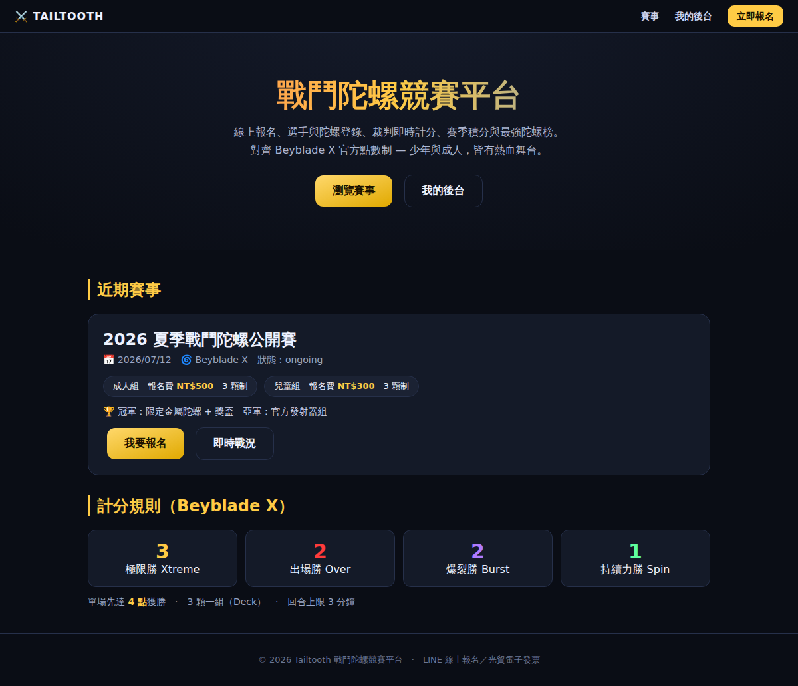
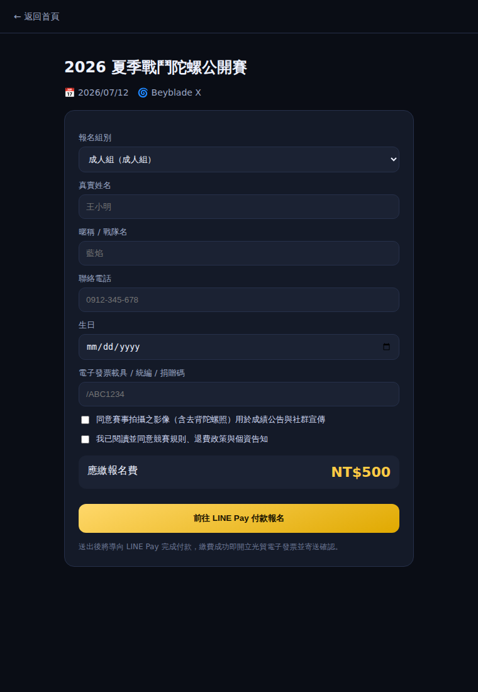
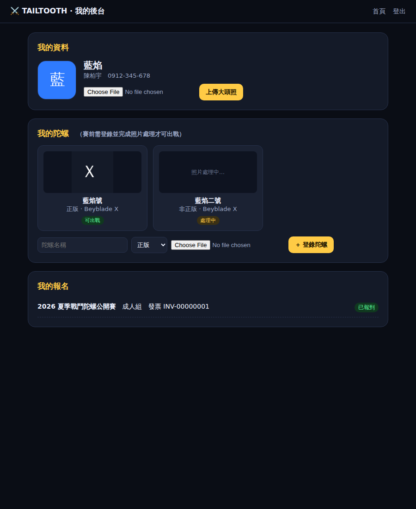
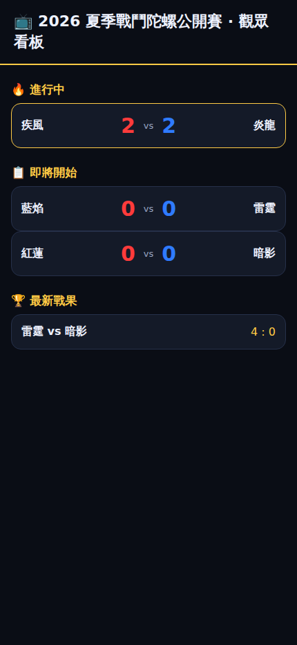
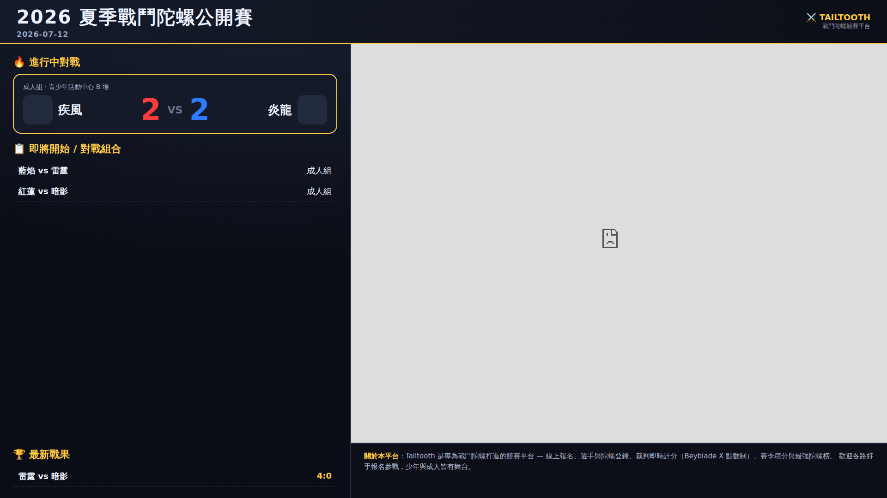
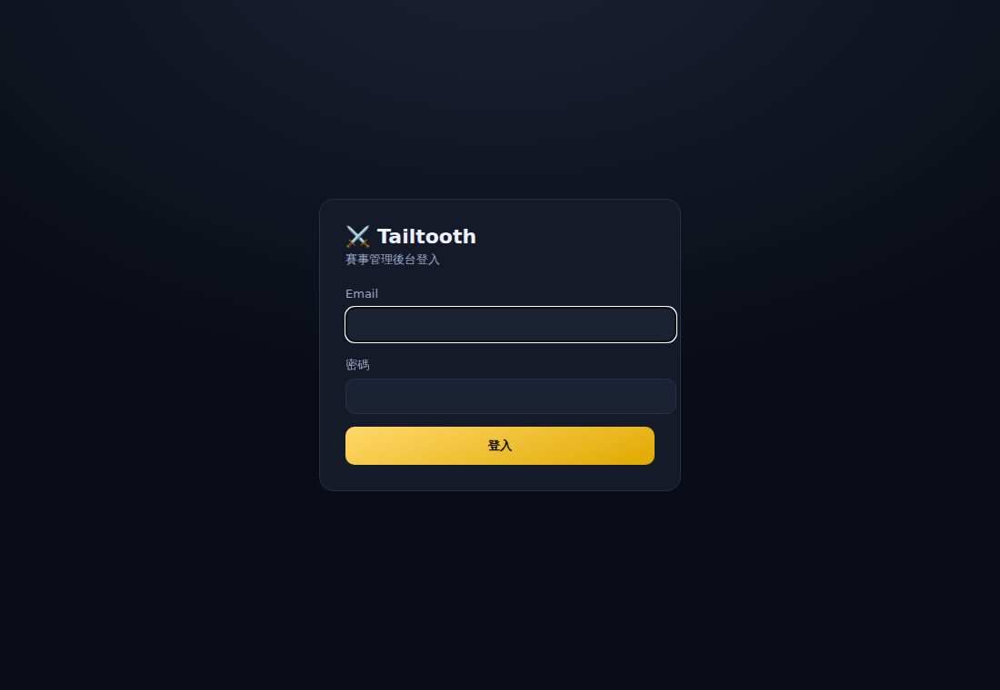
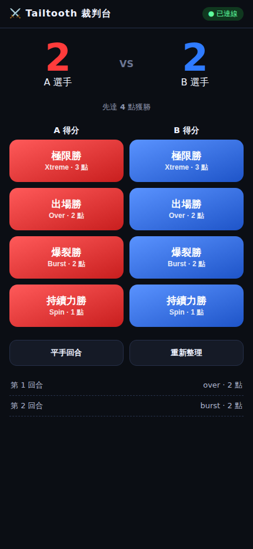
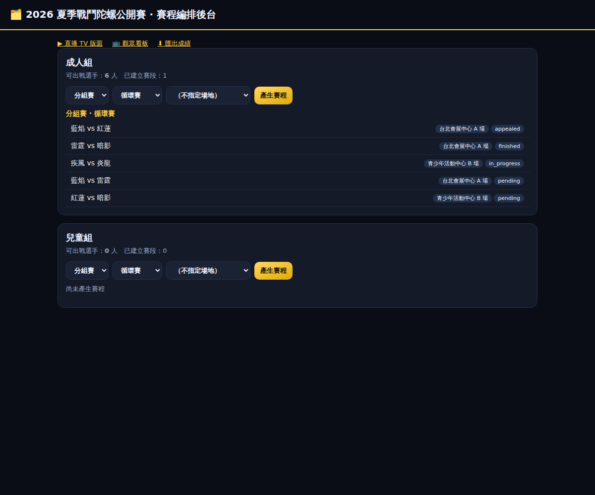
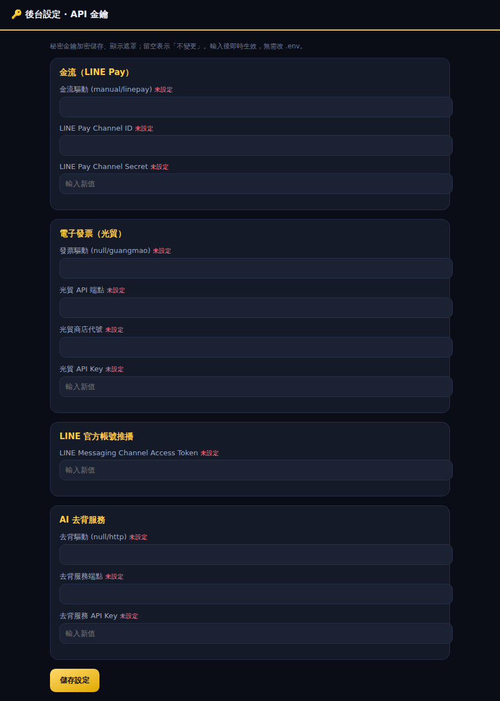
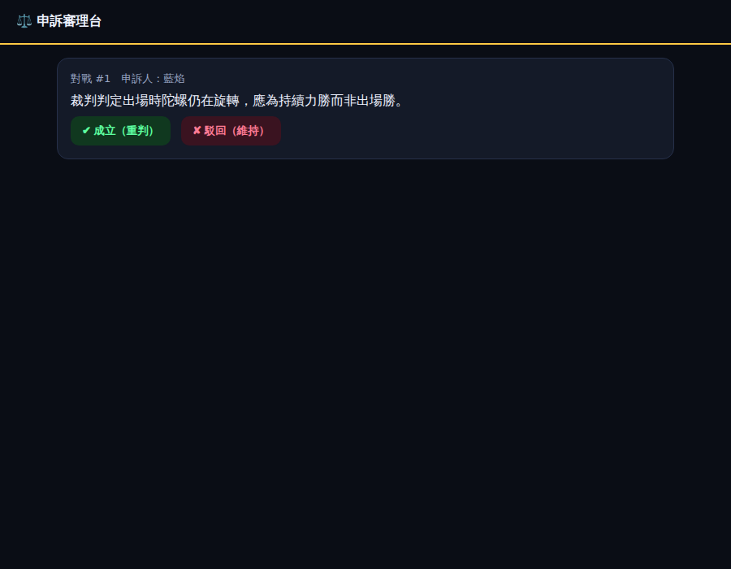

# Tailtooth 戰鬥陀螺競賽平台 — 圖文操作手冊

> 版本 v1.0 ｜ 對象：平台方／主辦單位／裁判／參賽者
> 本手冊以實際畫面說明前台（面向參賽者、觀眾）與後台（賽務、管理）的操作流程。

---

## 目錄

1. [系統總覽](#1-系統總覽)
2. [角色與權限](#2-角色與權限)
3. [前台操作](#3-前台操作面向參賽者觀眾)
   - 3.1 [首頁](#31-首頁)
   - 3.2 [報名](#32-報名)
   - 3.3 [我的後台](#33-我的後台選手陀螺登錄)
   - 3.4 [觀眾看板](#34-觀眾看板)
   - 3.5 [直播 TV 版面](#35-直播-tv-版面)
4. [後台操作](#4-後台操作賽務管理)
   - 4.1 [登入](#41-登入)
   - 4.2 [裁判計分](#42-裁判計分)
   - 4.3 [賽程編排](#43-賽程編排)
   - 4.4 [API 金鑰設定](#44-api-金鑰設定)
   - 4.5 [申訴審理](#45-申訴審理)
5. [一場賽事的完整流程](#5-一場賽事的完整流程)
6. [安裝與啟動](#6-安裝與啟動)

---

## 1. 系統總覽

Tailtooth 是專為戰鬥陀螺打造的競賽營運平台，涵蓋從報名收款到賽後公告的完整閉環：

```
報名 → LINE Pay 收款 → 光貿電子發票 → 選手/陀螺登錄(自拍去背) → 出戰資格驗證
  → 賽程編排(排種/輪空/抽選場地) → 裁判即時計分(Beyblade X 點數制)
  → Reverb 即時看板 → 直播 TV 版面 → 申訴審理 → 成績/積分/最強陀螺榜
  → 社群圖文 + LINE 發布 → 電子檔案匯出
```

競賽規則對齊 **Beyblade X 官方點數制**：

| Finish | 點數 | 說明 |
|---|:---:|---|
| 極限勝 Xtreme | 3 | 送入 Xtreme 專用區出場 |
| 出場勝 Over | 2 | 將對手打出戰鬥盤 |
| 爆裂勝 Burst | 2 | 對手陀螺解體 |
| 持續力勝 Spin | 1 | 對手陀螺先停止 |

單場先達 **4 點**獲勝、3 顆一組（Deck）、回合上限 3 分鐘。

---

## 2. 角色與權限

平台採 session 登入 + 角色權限（RBAC）。各角色可操作範圍：

| 範圍 | 可操作角色 |
|---|---|
| 後台設定／API 金鑰 | 平台、系統 |
| 賽程編排、社群發布 | 主辦、系統、平台 |
| 裁判計分、申訴審理 | 裁判、記錄員、主辦、系統、平台 |
| 報名、上傳、提申訴 | 參賽者（登入者） |

---

## 3. 前台操作（面向參賽者、觀眾）

### 3.1 首頁

平台門面，呈現近期賽事、組別與報名費、獎品、計分規則與報名入口。



**操作**
- 點「**我要報名**」進入該賽事報名頁。
- 點「**即時戰況**」進入觀眾看板。
- 右上「**我的後台**」管理個人資料與陀螺。

---

### 3.2 報名

選擇組別後填寫資料、勾選同意條款，送出後導向 LINE Pay 付款。



**操作步驟**
1. 選擇**報名組別**（系統依組別顯示對應報名費；兒童組會額外要求監護人欄位）。
2. 填寫真實姓名、暱稱、電話、生日。
3. （兒童組）填寫監護人資料並勾選**監護人同意**。
4. 填寫電子發票載具／統編／捐贈碼。
5. 勾選**影像使用授權**與**競賽規則／退費／個資同意**。
6. 點「**前往 LINE Pay 付款報名**」→ 系統建立報名並回傳付款資訊。

> 繳費成功後自動開立**光貿電子發票**並寄送 Email 確認。額滿時自動轉為**候補**。

---

### 3.3 我的後台（選手／陀螺登錄）

參賽者管理大頭照、陀螺與報名紀錄。**陀螺必須在賽前登錄且照片處理完成，才能在比賽期間被排序與出戰。**



**三個區塊**
- **我的資料**：上傳大頭照（系統自動置中裁切、統一尺寸）。冠軍可在排行榜展示。
- **我的陀螺**：填寫名稱、選正版／非正版、上傳自拍照 →（系統 AI 去背＋浮水印＋統一尺寸）。
  狀態為「**可出戰**」者方可上場；「**處理中**」表示照片仍在處理。
- **我的報名**：顯示各賽事報名狀態與發票號碼。

---

### 3.4 觀眾看板

手機／網頁即時戰況，分「進行中／即將開始／最新戰果」。透過 Reverb 即時推播更新（連不上時自動退回輪詢）。



---

### 3.5 直播 TV 版面

專為大螢幕／電視設計的 **1920×1080** 版面，可直接全螢幕投放。



**版面配置**
- **左側**：🔥進行中對戰（含大頭貼與即時比分）、📋即將開始／對戰組合、🏆最新戰果。
- **右側**：直播訊號（場次層級優先於賽事層級），下方為平台簡介。

> 上圖右側為占位畫面；接上可達的直播嵌入網址（YouTube/FB Live）後即顯示影像。

---

## 4. 後台操作（賽務、管理）

### 4.1 登入

以帳號密碼登入後台；不同角色登入後可見對應功能。



---

### 4.2 裁判計分

行動端優先的計分台，**離線也能計分**（暫存本機，回連自動補送、不重複計分）。



**操作**
1. 開啟該對戰的裁判頁（`/referee/{對戰編號}`）。
2. 依判定點選 A／B 方的 Finish 大按鈕（極限/出場/爆裂/持續力）。
3. 系統依點數制累計比分，任一方達 4 點自動判定勝負。
4. 「平手回合」記錄雙方同時停止／出場。
5. 上方連線狀態顯示「已連線／離線（計分已暫存）」。

---

### 4.3 賽程編排

主辦／系統在此產生賽程、指派與抽選場地，並偵測排程衝突。



**操作**
1. 每個組別顯示**可出戰選手數**與已建立賽段。
2. 選擇賽段（分組賽／複賽／冠軍戰）、賽制（循環賽／單敗淘汰）、場地。
3. 點「**產生賽程**」→ 系統依**賽季積分排種**自動配對（單敗淘汰自動補輪空）。
4. 下方列出對戰、場地與狀態；偵測到同一選手撞場會顯示**衝突警示**。
5. 複賽／冠軍戰可**抽選場地**（結果可重現並存證）。

---

### 4.4 API 金鑰設定

平台／系統管理者在此**自行輸入各項 API 金鑰**，無需修改 `.env`，輸入後即時生效。



**可設定項目**
- **金流（LINE Pay）**：驅動、Channel ID／Secret。
- **電子發票（光貿）**：驅動、API 端點、商店代號、API Key。
- **LINE 官方帳號推播**：Channel Access Token。
- **AI 去背服務**：驅動、端點、API Key。

> 秘密金鑰**加密儲存、顯示遮罩**；欄位**留空表示不變更**（不會清掉既有金鑰）。
> 讀取優先序：後台設定 > config/env。

---

### 4.5 申訴審理

裁判／主辦審理選手申訴。



**操作**
- **成立（重判）**：對戰比分歸零、回到「進行中」重新計分。
- **駁回（維持）**：維持原結果並標記為已確認。
- 申訴與裁決皆寫入防竄改存證鏈。

---

## 5. 一場賽事的完整流程

| 階段 | 角色 | 操作 |
|---|---|---|
| 1. 開賽事 | 主辦 | 建立賽事與組別、設定報名費與獎品 |
| 2. 設定金鑰 | 平台/系統 | 後台輸入 LINE Pay／光貿／LINE 金鑰（§4.4）|
| 3. 報名收款 | 參賽者 | 前台報名 → LINE Pay → 自動開發票（§3.2）|
| 4. 登錄陀螺 | 參賽者 | 上傳大頭照與陀螺照，等待「可出戰」（§3.3）|
| 5. 編排賽程 | 主辦 | 產生賽程、指派/抽選場地（§4.3）|
| 6. 現場計分 | 裁判 | 即時計分、必要時平手重打（§4.2）|
| 7. 即時看板 | 觀眾 | 看板/TV 版面即時更新（§3.4–3.5）|
| 8. 申訴處理 | 主審 | 審理申訴、成立則重判（§4.5）|
| 9. 賽後公告 | 主辦 | 產生戰果卡、LINE 廣播、匯出成績電子檔 |

---

## 6. 安裝與啟動

```bash
# 1. 安裝與初始化
composer install
cp .env.example .env && php artisan key:generate
php artisan migrate --seed                 # 建立平台管理者
php artisan db:seed --class=DemoSeeder      # （選用）灌入示範資料

# 2. 啟動服務
php artisan serve                           # 網站
php artisan reverb:start                    # 即時推播（VPS 上以 supervisor 常駐）
php artisan queue:work                      # 佇列（照片處理、通知）

# 3. 預設帳號（示範資料）
#   後台：admin@tailtooth.local  / password   （平台/主辦/系統）
#   前台：player@tailtooth.local / password   （參賽者）
```

**上線前檢查**
- [ ] 後台 `/admin/settings` 填入正式金鑰，並把驅動切到 `linepay` / `guangmao`。
- [ ] 正式機安裝中文字型 `fonts-wqy-zenhei`（或設 `BEY_FONT_PATH`），確保社群圖文中文正常。
- [ ] `reverb:start` 與 `queue:work` 以 supervisor 常駐。
- [ ] 設定 Email（SPF/DKIM/DMARC）避免確認信進垃圾桶。

---

> 相關文件：[`competition-system-plan.md`](competition-system-plan.md)（總體架構與規劃）、[`../README.md`](../README.md)（技術說明）。
